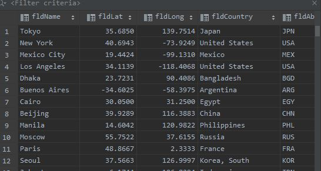
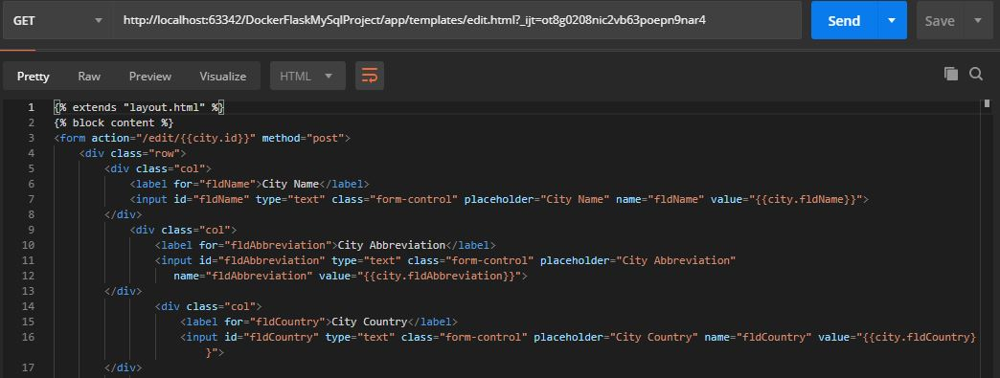
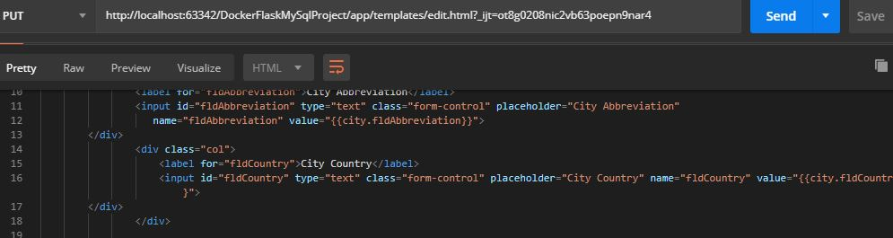
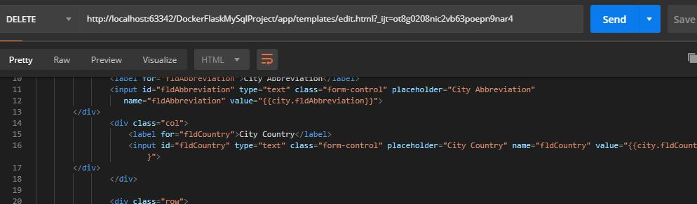

# Project Description
This is the Final Project Part 1 on the topics of Pycharm, setup with Docker, Flask, MySql

# Query Screenshot

# Postman Screenshot
 

#Get Screenshot

#Put Screenshot

# Delete Screenshot
